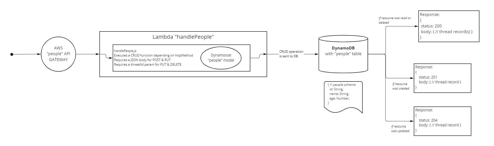

# AWS API with Dynamo and Lambda

A single resource REST API using a "people" model, constructed using AWS Cloud Services. This uses a single "handlePeople" Lambda with a multi-CRUD route handler for processing requests for the Dynamo DB "people" table.

[**Link to my API**](https://m93jyhzd5c.execute-api.us-west-2.amazonaws.com/Dev)

## UML Diagram



## Authors/Contributors

- Jeffrey Jenkins

## Routes

### `/people` CRUD

- POST : `/people`
  - Requires a JSON body containing `id`, `age`, and `name` props.
  - Response
    - Status `201`, and a JSON body which is the `people` record created in the database.

- GET : `/people[/:id]`
  - Optionally include an id to GET a specific record
  - Response
    - Status `200`, and a JSON body which contains all people in the database, or the record specified by the `id` param.
- PUT : `/people/:id`
  - Requires a JSON body containing the data to update in the target record.
  - Requires an `id` param.
  - Response
    - Status `204`, and a JSON body which is the `people` record updated in the database.

- DELETE : `/people/:id`
  - Requires an `id` param
  - Response
    - Status `200`, and a JSON body which is the `people` record removed from the database.

## Schema

```js
{
  id: String,
  name: String,
  age: Number,
}
```
